# Azure Cognitive Search Lab

Azure Cognitive Search Lab (also known as AzSearchLab) is a web-based debugging tool for [Azure Cognitive Search](https://docs.microsoft.com/azure/search/search-what-is-azure-search) troubleshooting. It provides a centralized interface for designing and testing indexing and query operations.

This tool is written in C# but calls the [Search REST APIs for](https://docs.microsoft.com/rest/api/searchservice/) specific operations.

## Features

This project framework is designed to run locally. It connects to your Azure Cognitive Search service, with the ability to test the following features:

* Queries
* Index definitions
* Documents
* Suggestions 
* Analyzers
* Autocomplete 
* Synonyms 
* Built-in analyzers
* Web api skills

### Prerequisites

This project assumes a Windows development environment.

* [.Net 5.0 or greater](https://dotnet.microsoft.com/download/dotnet)
* [Visual Studio 2019 or greater](https://visualstudio.microsoft.com/downloads/)
* Azure Cognitive Search in your Azure subscription

## Getting Started

Download the source code, open the solution in Visual Studio, and press F5 to build the project. After it builds, you can run the website locally with IIS Express. 

Alternatively, you can also deploy this website to your app service. 
  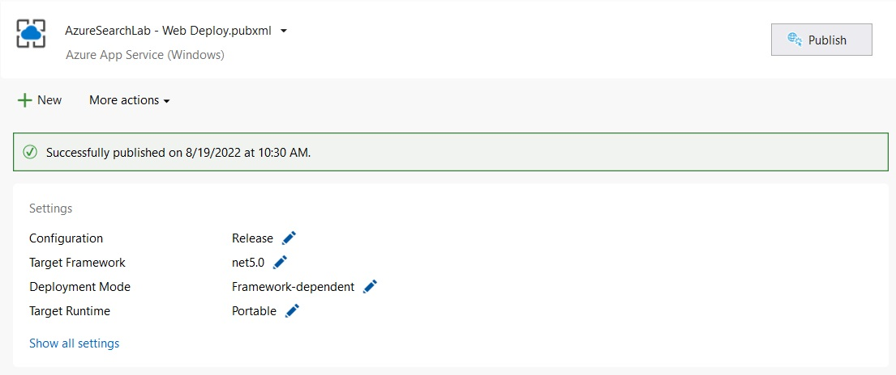

1. Download the package and extract the source files. 
   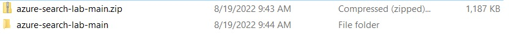

2. Open the source code with Visual Studio 2019 or higher version. 

3. Press F5 to build the project:
 
   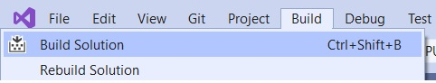

4. Run the source code with IIS Express. 

   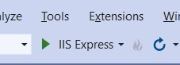

5. Enter the search service name and its key. Then load the service information. You should see all of the indexes that exist in your service.

6. There are GET and POST type query. With this tool, you don't need to check the document for each parameter and its format. You can select the parameter on UI， then test the GET or POST query and analyze its query result.

   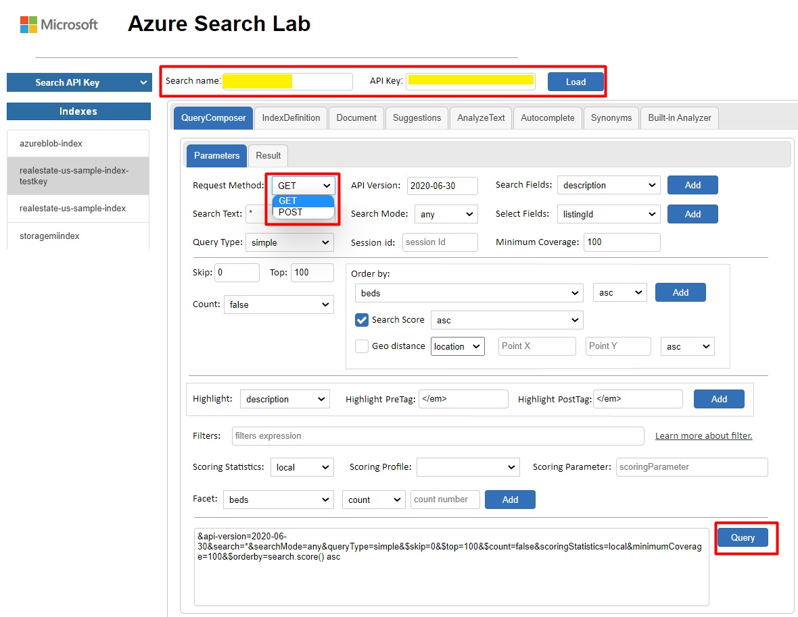

   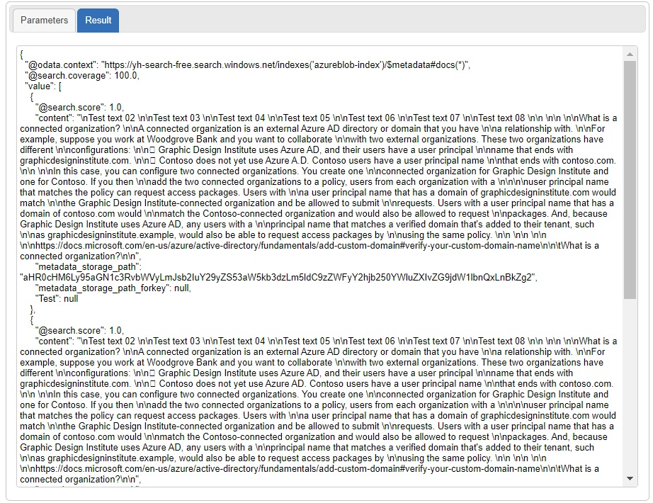

7. Update an [index definition](https://docs.microsoft.com/azure/search/search-how-to-create-search-index).

   Updates to an index definition isn't allowed on the Azure portal and can only be changed programmatically. Azure Search Lab supports direct updates to an index JSON definition.

   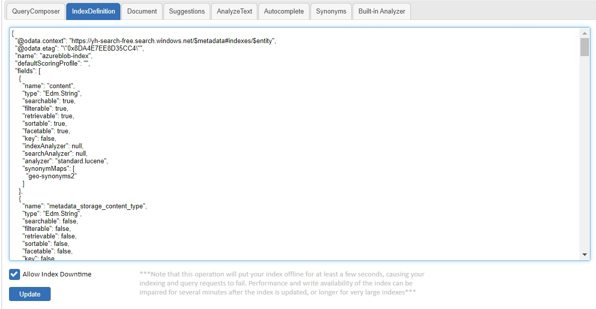

8. Query and update document.

   You can also change and update a search document after it's been indexed. For this task, [query the documents](https://docs.microsoft.com/azure/search/search-query-create) to find one you want to change, then make your update and save the changes to index.
   
   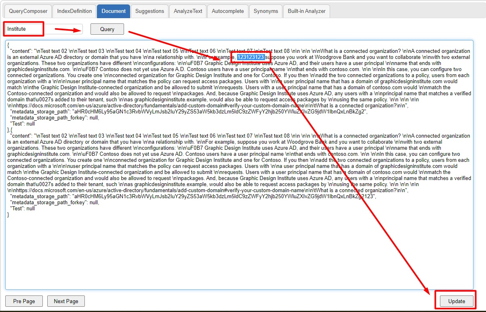

9. Test [suggestions](https://docs.microsoft.com/azure/search/index-add-suggesters).

   This tool provide a UI to simulate suggestions.
   
   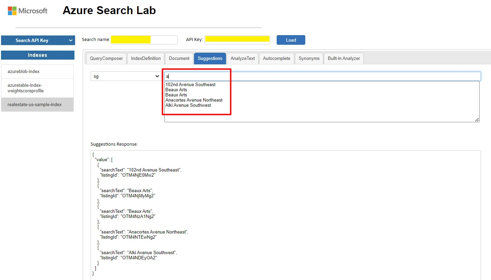

10. Test [analyzer behaviors](https://docs.microsoft.com/azure/search/index-add-custom-analyzers#test-custom-analyzers).

    You can load a search index and test its analyzer configurations. This step shows you how the analyzer processes text into tokens.
    
    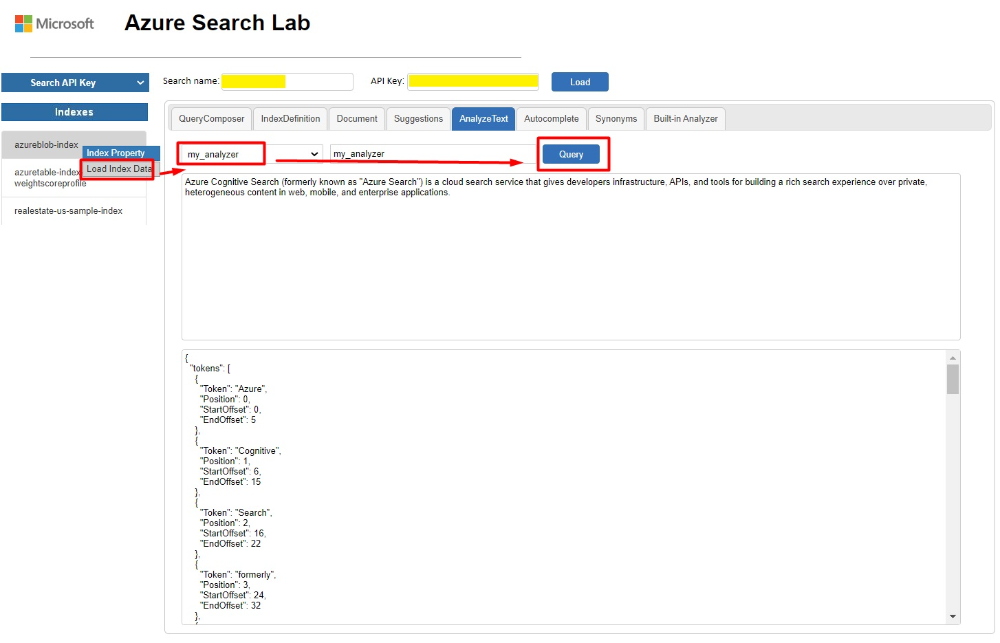

11. Test [autocomplete](https://docs.microsoft.com/azure/search/index-add-suggesters).

    You can test the auto-complete rule of the index and confirm its behavior.
   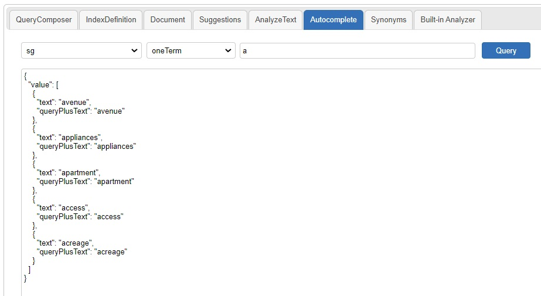

12. Create, update and delete [synonym maps](https://docs.microsoft.com/azure/search/search-synonyms).

    You can create, update or delete the synonym map on index fields.
    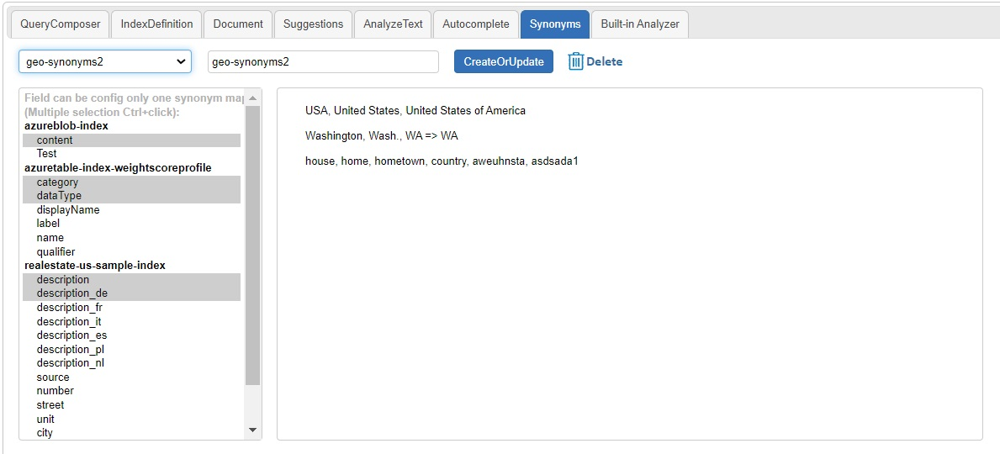

    You can create new synonym maps by specifying a name, adding rules, and selecting which index fields that synonym map should be used with. You can use Ctrl+Click to multi-select the fields you want to assign.
    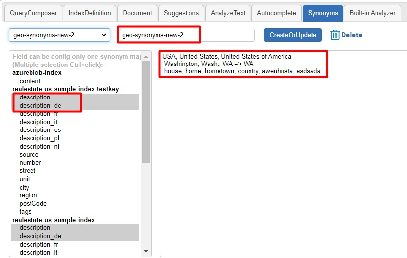

    You can also delete an existing synonym map.
    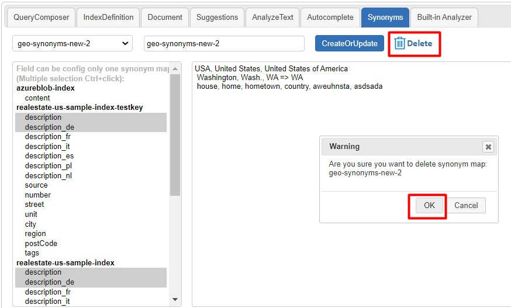

    You can also update a field's synonym map assignment by selecting or de-selecting them. Notice that each field can have ONLY one synonym map. So if you update the field with a new assignment, the previous synonym configured on this field is removed automatically.
    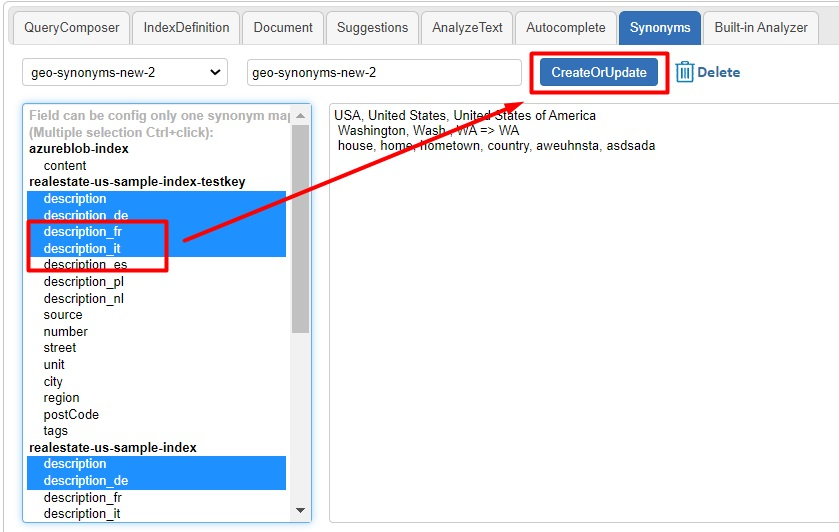

13. Test built-in [analyzers, tokenizers, token filters and char filters](https://docs.microsoft.com/azure/search/search-analyzers).

    You can test different built-in analyzers, tokenizers, token filters and char filters to select the one that fits your project. The tool shows you how the various combinations break text into tokens.
    
    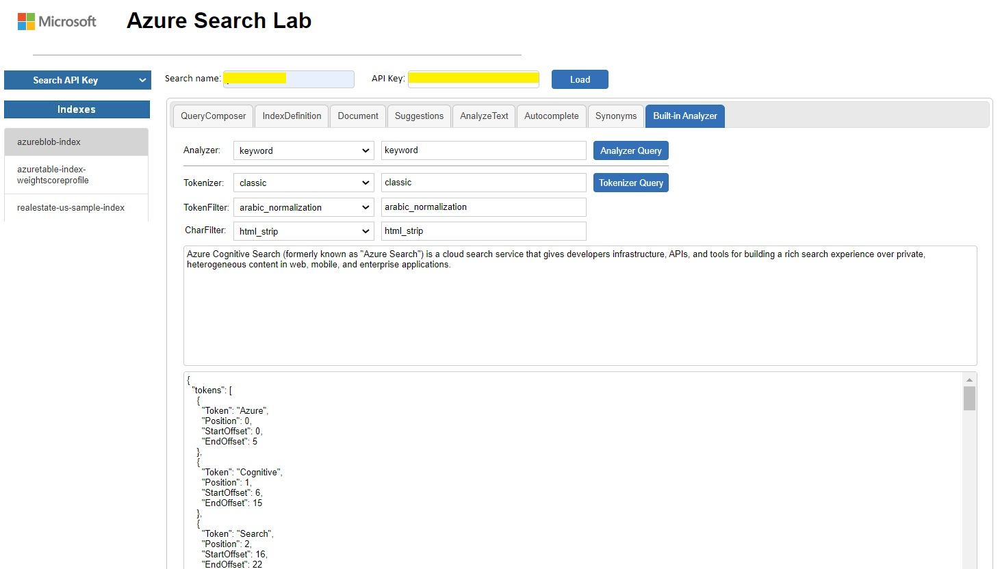
  
14. Test a [Custom Web API skill](https://docs.microsoft.com/azure/search/cognitive-search-custom-skill-web-api).

    You can test a custom web api skill's behavior. The URL, method, headers and payload format will be extracted from the web api skill automatically. You can then change the payload to use real data or test data. Make POST/PUT request to web api server. The response will appear in the tool.
    
    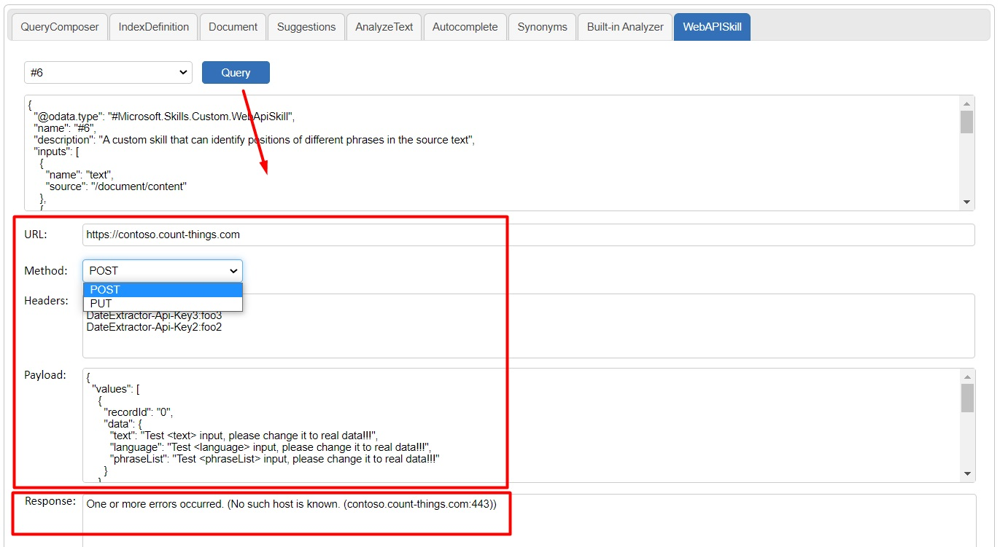
